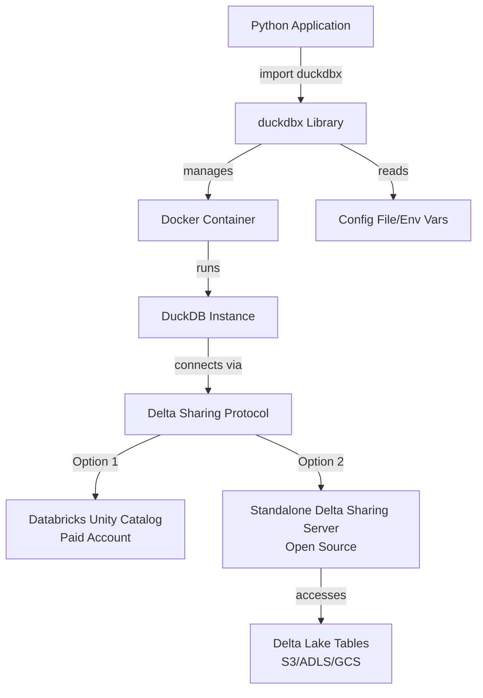

# DuckDBX Implementation Plan

## Architecture Overview

duckdbX will be a Python library that manages ephemeral DuckDB Docker containers connected to Databricks via Unity Catalog and Delta Sharing. The library provides both manual lifecycle management and context manager patterns for easy usage.

**Delta Sharing Support**: The library supports two modes:
1. **Databricks-managed Delta Sharing** (requires paid Databricks account with Unity Catalog)
2. **Standalone Delta Sharing server** (open-source, works with free Databricks or any Delta Lake source)



## Project Structure

```
duckdbX/
├── duckdbx/                    # Main package
│   ├── __init__.py            # Public API exports
│   ├── core.py                # DuckDBX main class
│   ├── container.py           # Docker container management
│   ├── connection.py          # Databricks connection handling
│   ├── config.py              # Configuration management
│   └── exceptions.py          # Custom exceptions
├── docker/
│   ├── Dockerfile             # DuckDB container with extensions
│   └── docker-compose.yml     # Optional compose setup
├── tests/                     # Test suite
│   ├── test_core.py
│   ├── test_container.py
│   ├── test_connection.py
│   └── test_config.py
├── examples/                  # Usage examples
│   ├── basic_usage.py
│   └── context_manager.py
├── pyproject.toml             # Package configuration
├── requirements.txt           # Dependencies
├── requirements-dev.txt       # Dev dependencies
├── README.md                  # Documentation
└── .env.example               # Example environment variables
```

## Implementation Components

### 1. Core Package Structure (`duckdbx/`)

**`duckdbx/__init__.py`**: Expose main API

- Export `DuckDBX` class
- Export exceptions
- Version info

**`duckdbx/core.py`**: Main `DuckDBX` class

- Implements context manager pattern (`__enter__`, `__exit__`)
- Manual lifecycle methods (`start()`, `stop()`, `is_running()`)
- Query execution interface (`execute()`, `query()`)
- Connection to DuckDB instance in container

**`duckdbx/container.py`**: Docker container management

- `ContainerManager` class to handle Docker operations
- Spin up containers with proper configuration
- Health checks and status monitoring
- Cleanup and teardown
- Port management (find available ports)

**`duckdbx/connection.py`**: Databricks/Delta Sharing integration

- Support for two connection modes:
  - **Databricks-managed**: Unity Catalog connection setup with Delta Sharing
  - **Standalone**: Connect to open-source Delta Sharing server endpoint
- Delta Sharing protocol configuration
- Credential management (token, OAuth, profile files)
- Connection string generation for DuckDB
- Automatic detection of connection mode based on configuration

**`duckdbx/config.py`**: Configuration management

- Load from config file (`~/.duckdbx/config.yaml`)
- Load from environment variables
- Accept parameters directly
- Priority: params > env vars > config file
- Validation and defaults

**`duckdbx/exceptions.py`**: Custom exceptions

- `DuckDBXError` (base)
- `ContainerError`
- `ConnectionError`
- `ConfigurationError`

### 2. Docker Setup (`docker/`)

**`docker/Dockerfile`**:

- Base on official DuckDB image or Python image with DuckDB
- Install Delta Sharing extension
- Configure for remote connections
- Expose DuckDB HTTP interface or use named pipes/sockets
- Minimal footprint for ephemeral instances

**`docker/docker-compose.yml`** (optional):

- Development setup
- Volume mounts for testing
- Network configuration

### 3. Configuration Management

Support multiple configuration methods with priority:

1. Function parameters (highest priority)
2. Environment variables
3. Config file (`~/.duckdbx/config.yaml`)

Configuration fields:

**For Databricks-managed Delta Sharing:**
- `databricks_host`: Databricks workspace URL
- `databricks_token`: Personal access token or OAuth token
- `unity_catalog_name`: Unity Catalog name
- `delta_sharing_profile_path`: Path to Delta Sharing profile file

**For Standalone Delta Sharing Server:**
- `delta_sharing_server_url`: URL of standalone Delta Sharing server
- `delta_sharing_profile_path`: Path to Delta Sharing profile file (contains server endpoint and credentials)
- `delta_sharing_bearer_token`: Bearer token for authentication (if not in profile)

**Common settings:**
- `connection_mode`: "databricks" or "standalone" (auto-detected if not specified)
- `container_image`: Custom DuckDB image (optional)
- `container_name`: Container name prefix
- `timeout`: Connection timeout

### 4. Key Features

**Lifecycle Management**:

- Manual: `instance.start()`, `instance.stop()`
- Context manager: `with DuckDBX(...) as db: ...`
- Auto-cleanup on errors

**Query Interface**:

- `execute(sql)`: Execute SQL, return cursor
- `query(sql)`: Execute query, return results (DataFrame/Polars)
- Support for parameterized queries

**Connection Management**:

- Lazy connection (connect on first query)
- Connection pooling (single connection per instance)
- Automatic reconnection on failure

**Data Minimization**:

- Use Delta Sharing for federated queries
- Push down filters and aggregations
- Only fetch required columns/rows

### 5. Dependencies

**Core dependencies**:

- `duckdb`: DuckDB Python package
- `docker`: Docker SDK for Python
- `pyyaml`: YAML config parsing
- `pydantic`: Configuration validation (optional)

**Optional dependencies**:

- `pandas`: DataFrame support
- `polars`: Polars DataFrame support
- `pyarrow`: Arrow format support

### 6. Testing Strategy

- Unit tests for configuration, connection logic
- Integration tests with mock Docker containers
- Example scripts demonstrating usage patterns
- Test both manual and context manager patterns

### 7. Standalone Delta Sharing Server Setup

Since Databricks Free Edition doesn't support Delta Sharing, users can set up an open-source Delta Sharing server:

**Option A: Use existing Delta Sharing server**
- Configure `delta_sharing_server_url` and provide profile file
- Profile file contains endpoint URL and authentication credentials

**Option B: Deploy standalone server** (future enhancement)
- Could include helper scripts or Docker compose for deploying a Delta Sharing server
- Server would expose Delta tables from S3/ADLS/GCS via Delta Sharing protocol
- This allows sharing Delta tables without Databricks Unity Catalog

**Implementation Notes:**
- DuckDB's Delta Sharing extension can connect to any Delta Sharing-compatible server
- Profile file format is standardized (JSON with endpoint, bearer token, etc.)
- Library should validate profile file and connection mode

### 8. Documentation

- README with quick start guide
- API documentation
- Examples for common use cases
- Configuration guide for both connection modes
- Guide for setting up standalone Delta Sharing server (if needed)
- Troubleshooting section

## Implementation Todos

1. **setup-package-structure**: Create package structure with `duckdbx/` directory and core modules
2. **implement-config**: Build configuration management supporting file/env/params with priority system
3. **implement-container-manager**: Create Docker container management class for spinning up DuckDB containers
4. **implement-connection**: Build connection logic supporting both Databricks-managed Delta Sharing (Unity Catalog) and standalone open-source Delta Sharing server, with auto-detection based on configuration
5. **implement-core-class**: Create main `DuckDBX` class with context manager and manual lifecycle methods
6. **create-dockerfile**: Build Dockerfile for DuckDB container with Delta Sharing extensions
7. **implement-query-interface**: Add query execution methods (`execute`, `query`) with result handling
8. **add-exceptions**: Create custom exception hierarchy
9. **setup-dependencies**: Configure `pyproject.toml` and `requirements.txt` with all dependencies
10. **create-examples**: Write example scripts demonstrating usage patterns
11. **update-readme**: Create comprehensive README with installation, usage, configuration guide for both Databricks-managed and standalone Delta Sharing modes
12. **add-tests**: Create basic test suite for core functionality